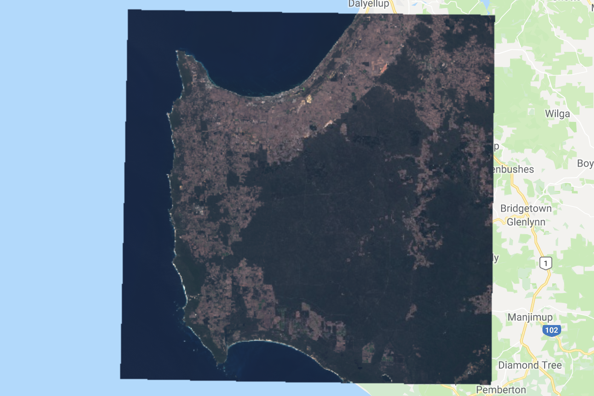

GEARS - Geospatial Ecology and Remote Sensing lab - https://www.gears-lab.com

# Introduction to Remote Sensing of the Environment
Assessment Item 3 - Image classification and validation
-----------------

The skills required to complete this assessment have been covered in Labs 4-7, but some further exploration and independent research will be required on your part. Talk to your classmates and use the Discussion board if you get stuck.

----

## Overview of tasks

You have been hired by the wine growers association of Western Australia to conduct a landcover classification for the Margret River region.

1. You need to produce a map that consists of 6 landcover classes:
  - Vineyards
  - Green pasture
  - Dry pasture
  - Scrub (natural bush)
  - Infrastructure
  - Water

2. Describe how you conducted the classification
3. Present quantitative data on the accuracy of your classification
4. Discuss how reliable you consider your classification to be, and how it could be improved

### Imagery

The classification should be based on a Sentinel-2 image collected on 2nd April 2018
(COPERNICUS/S2/20180402T021341_20180402T022350_T50HLH)

### Assignment format

You are required to write a short report with the following sections:
- Aims and objectives (5 marks)
- Methods (10 marks)
- Results (15 marks)
- Discussion (10 marks)

Total = 40 marks

*Due date* : 26 May 2019

*Submission format* : Single PDF document submitted via in Learnline

*Filename format* : Lastname_Assessment3_ENVXXX.pdf

Your short report should include:
- your name
- your course code
- title

------

Remember that recorded videos of previous tutorials can be found on my YouTube Channel's [Introduction to Remote Sensing of the Environment Playlist](https://www.youtube.com/playlist?list=PLf6lu3bePWHDi3-lrSqiyInMGQXM34TSV).

#### Kind regards, Shaun R Levick
------
