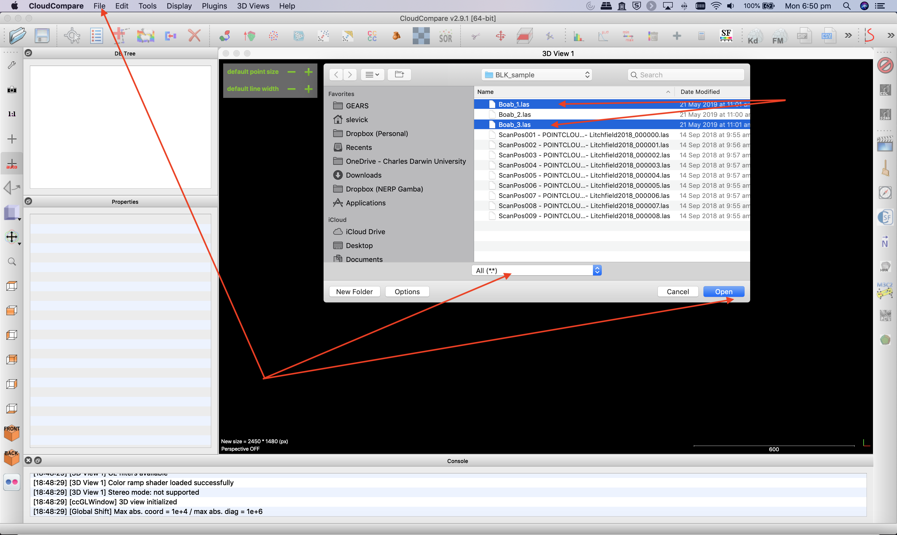

GEARS - Geospatial Engineering and Remote Sensing lab - https://www.gears-lab.com

# Introduction to Remote Sensing of the Environment
Lab 10 - Working with Terrestrial Laser Scanning (TLS) data in CloudCompare continued
--------------

### Prerequisites
-------------

Completion of this lab exercise requires use of the CloudCompare software package. CloudCompare is a powerful package for visualising and processing point-clouds, and best of all is open-access. You can download the version to match your operating system here:

https://www.danielgm.net/cc/

------------------------------------------------------------------------

### Background and objective

The objective of this lab is to familiarise yourself with 3D point cloud data. We will use data that we collected last week on campus in the Boab court. We collected multiple scans with a Leica BLK360 laser scanner, and we will work with some of these scans today.

Scan data can be downloaded in .las format here (please note that each file is ~ 1GB):

[Scan 1](https://www.dropbox.com/s/e172wfagzt50qfm/Boab_1.las?dl=0) | [Scan 2](https://www.dropbox.com/s/faa42pr89rdc7g6/Boab_2.las?dl=0) | [Scan 3](https://www.dropbox.com/s/pta1p7h50gta434/Boab_3.las?dl=0)

----------

## Getting to know CloudCompare

Please see last week's lab here: [Lab 9](https://github.com/geospatialeco/GEARS/blob/master/Intro_RS_Lab9.md)

## Merging multiple point clouds

1. Open up CloudCompare and choose File>Open from the main menu.

2. Navigate to where the scan data are stored and select Boab_1.las and Boab_3.las before clicking "Open". If you cannot see your files or they are greyed out, make sure you have the file type set to ".las" or "All".

3. Click "Apply to all" and "Yes to all" when the two dialogue boxes pop up.

4. Once the two files have loaded, you will see that they are not correctly aligned.

5. In fact, if you zoom in closer (using the mouse wheel), you will see that they are positioned exactly on top of each other.

### Thank you

I hope you found that useful. A recorded video of this tutorial can be found on my YouTube Channel's [Introduction to Remote Sensing of the Environment Playlist](https://www.youtube.com/playlist?list=PLf6lu3bePWHDi3-lrSqiyInMGQXM34TSV) and on my lab website [GEARS](https://www.gears-lab.com).

#### Kind regards, Shaun R Levick
------
