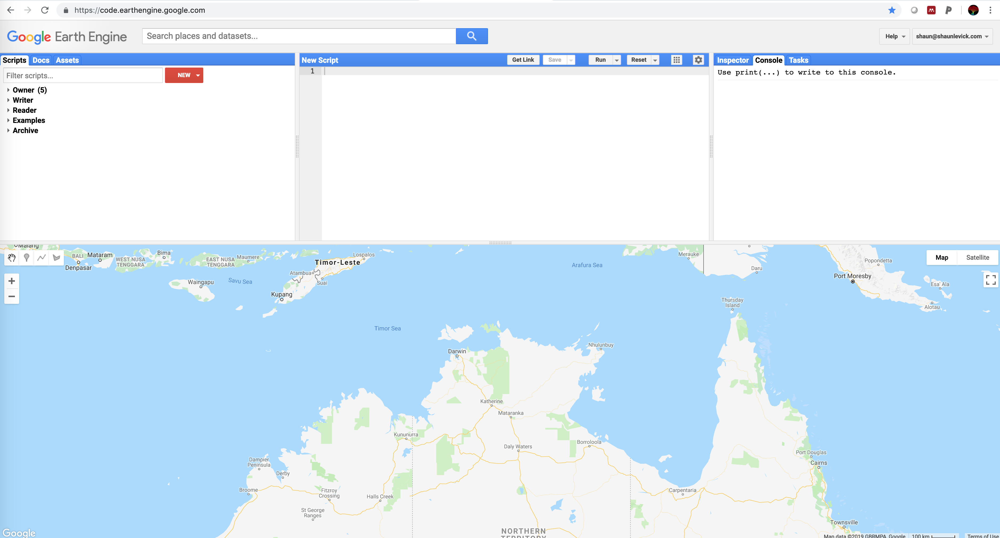
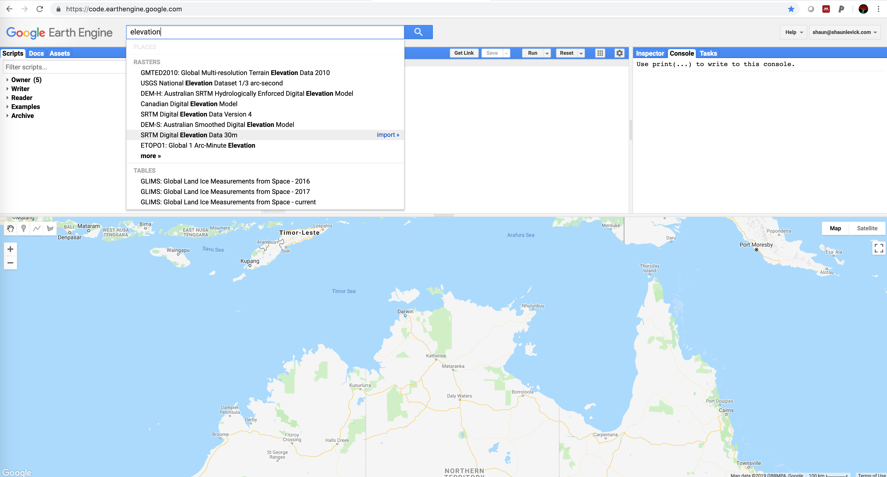

GEARS - Geospatial Engineering and Remote Sensing lab - https://www.gears-lab.com

# Introduction to Remote Sensing of the Environment
Lab 2 - Understanding band combinations and spectral response curves in Google Earth Engine
--------------

### Acknowledgments
- Google Earth Engine Team
- Earth Engine Beginning Curriculum

------

### Prerequisites
-------------

Completion of this lab exercise requires use of the Google Chrome browser and a Google Earth Engine account. If you have not yet signed up - please do so now in a new tab:

[Earth Engine account registration](https://signup.earthengine.google.com/)

Once registered you can access the Earth Engine environment here:
https://code.earthengine.google.com

Google Earth Engine uses the JavaScript programming language. We will cover the very basics of this language during this course. If you would like more detail you can read through the introduction provided here:

[JavaScript background](https://developers.google.com/earth-engine/tutorial\_js\_01)

------------------------------------------------------------------------

### Objective
---------

The objective of this lab is to strengthen your understanding of image visualisation principles, and develop practical skills in mapping band combinations and exploring reflectance spectra.


## 2. Loading a Sentinel-2 multispectral image

1. For this lab we will use a multi-spectral image collected by the European Space Agency's Sentinel-2 satellite.

```JavaScript
var sent2 = ee.Image("COPERNICUS/S2/20180422T012719_20180422T012714_T52LHM")
```




2. Clear the script workspace by selecting "Clear script" from the Reset button dropdown menu.


3. Search for “elevation” and click on the SRTM Digital Elevation Data 30m result to show the dataset description.



4. View the information on the dataset, and then click on Import, which moves the variable to the Imports section at the top of your script.


-------
### Thank you

I hope you found that useful. A recorded video of this tutorial can be found on my YouTube Channel's [Introduction to Remote Sensing of the Environment Playlist](https://www.youtube.com/playlist?list=PLf6lu3bePWHDi3-lrSqiyInMGQXM34TSV) and on my lab website [GEARS](https://www.gears-lab.com).

#### Kind regards, Shaun R Levick
------
