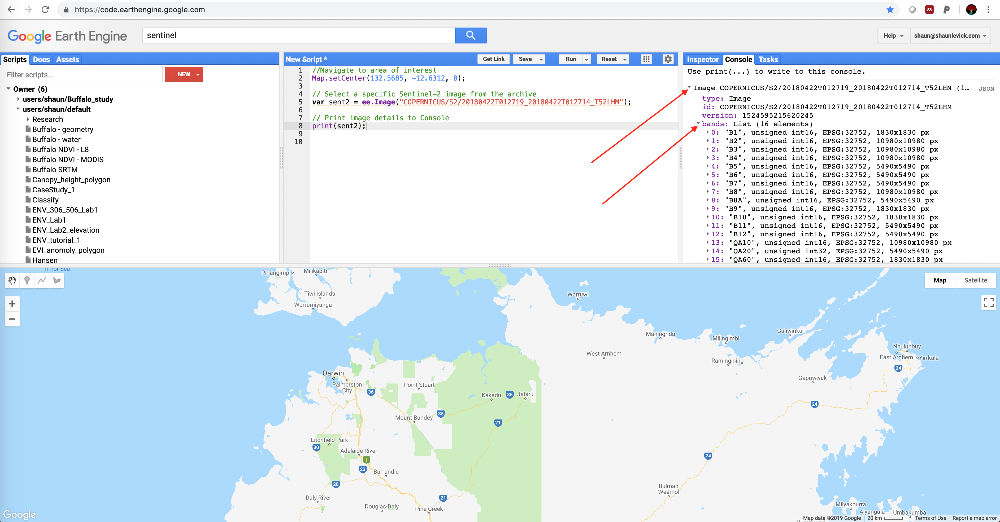
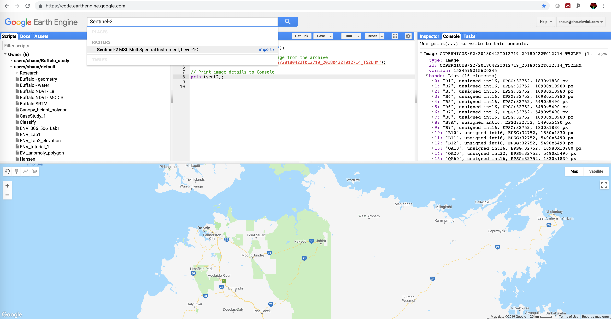

GEARS - Geospatial Engineering and Remote Sensing lab - https://www.gears-lab.com

# Introduction to Remote Sensing of the Environment
Lab 2 - Understanding band combinations and spectral response curves
--------------

### Acknowledgments
- Google Earth Engine Team
- Google Earth Engine Developers group

------

### Prerequisites
-------------

Completion of this lab exercise requires use of the Google Chrome browser and a Google Earth Engine account. If you have not yet signed up - please do so now in a new tab:

[Earth Engine account registration](https://signup.earthengine.google.com/)

Once registered you can access the Earth Engine environment here:
https://code.earthengine.google.com

Google Earth Engine uses the JavaScript programming language. We will cover the very basics of this language during this course. If you would like more detail you can read through the introduction provided here:

[JavaScript background](https://developers.google.com/earth-engine/tutorial\_js\_01)

------------------------------------------------------------------------

### Objective


The objective of this lab is to strengthen your understanding of image visualisation principles, and develop practical skills in mapping band combinations and exploring reflectance spectra.


## Loading a Sentinel-2 multispectral image

1. For this lab we will use a multi-spectral image collected by the European Space Agency's Sentinel-2 satellite. Sentinel-2 is a wide-swath, high-resolution, multi-spectral imaging mission supporting Copernicus Land Monitoring studies, including the monitoring of vegetation, soil and water cover, as well as observation of inland waterways and coastal areas. We will use an image collected over Kakadu National Park, Australia.

2. Let's navigate to the area of interest (Kakadu) by copying the code below into the Code Editor and clicking "Run". Remember that the line starting with // is a note to ourselves and to others, and is not processed (we call this a comment). The numbers in brackets are the longitude, latitude, and zoom level (range is from 1 to 22).

```JavaScript
//Navigate to area of interest
Map.setCenter(132.5685, -12.6312, 8);
```


3. Now that we are in the right place, let's choose a Sentinel-2 image using the code below. Copy and paste into the Code Editor and click "Run". Copernicus refers to the satellite mission, S2 is short for Sentinel-2, and the long number 20180422T012719_20180422T012714_T52LHM refers to a specific image, defined by a date, time and a path and row of the satellite's orbit.

```JavaScript
// Select a specific Sentinel-2 image from the archive
var sent2 = ee.Image("COPERNICUS/S2/20180422T012719_20180422T012714_T52LHM");
```

4. If the code did not return any errors, then the image was successfully found in the archive. To double check, let's run the line below to print the image information to the Console. Once the information loads in the Console, you can click the little dropdown arrows next to "Image" and "bands" to see more details about the band structure and naming format.

```JavaScript
// Print image details to the Console
print(sent2);
```



5. We can see from the Console information that the image contains multiple bands, called B1, B2, B3 etc. To find out which wavelengths these bands represent, lets use the seach bar to find out more information. Type "Sentinel-2" in to the search bar and you will see it appear in the results list.



6. Click on "Sentinel-2 MSI: MultiSpectral Instrument, Level 1-C" to open the information panel. The table provided is very useful for gaining a quick overview of the available bands, their wavelengths and spatial resolutions.


7. Bands 2,3 and 4 are the blue, green and red bands respectively. Therefore if we wish to view a true-colour rendering of the image - i.e. an RGB composite, we need to place Band 4 into the red channel, Band 3 into the green channel, and Band 2 into the blue channel. We can do this with the code below - take careful note of the syntax for specifying the band arrangement.

```JavaScript
Map.addLayer(sent2,{bands:['B4','B3','B2']});
```


-------
### Thank you

I hope you found that useful. A recorded video of this tutorial can be found on my YouTube Channel's [Introduction to Remote Sensing of the Environment Playlist](https://www.youtube.com/playlist?list=PLf6lu3bePWHDi3-lrSqiyInMGQXM34TSV) and on my lab website [GEARS](https://www.gears-lab.com).

#### Kind regards, Shaun R Levick
------
