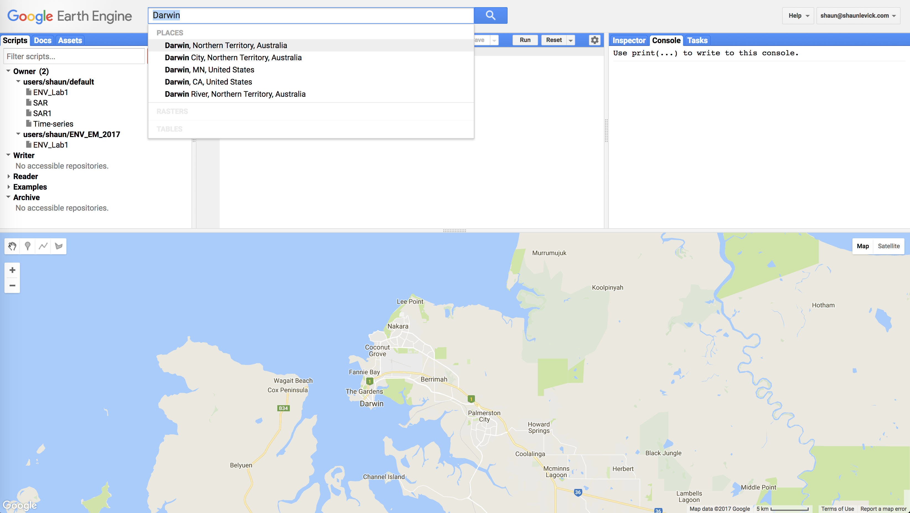
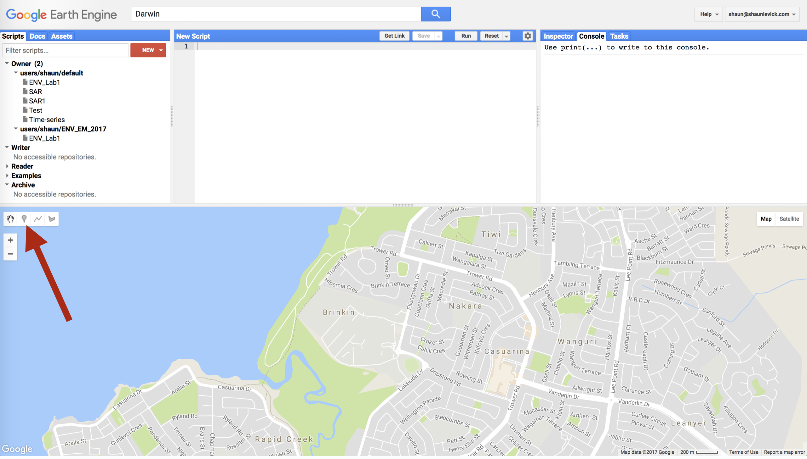
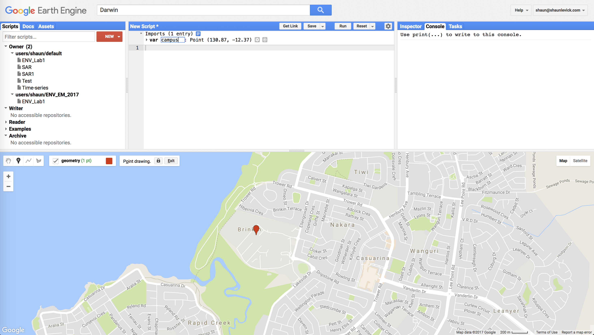
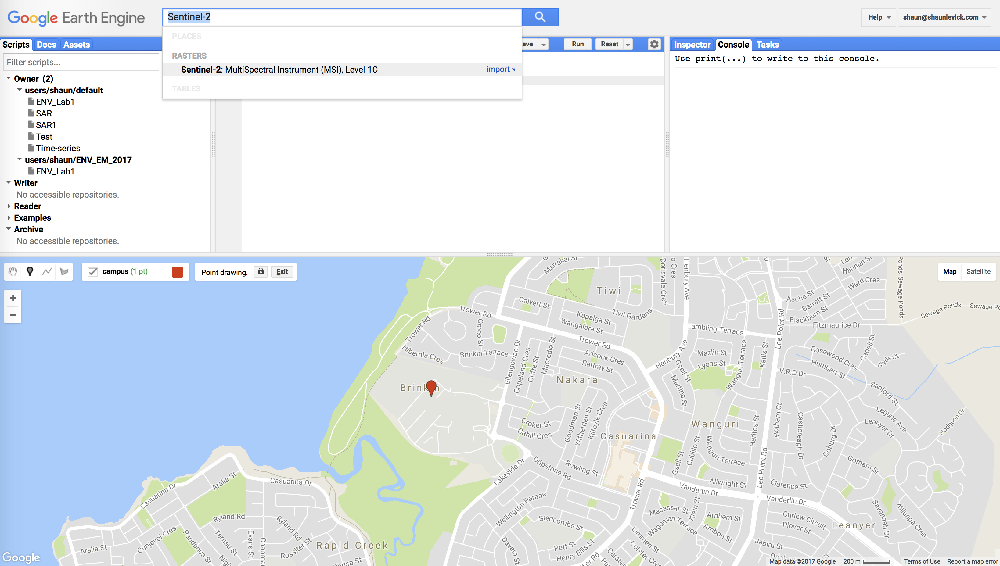
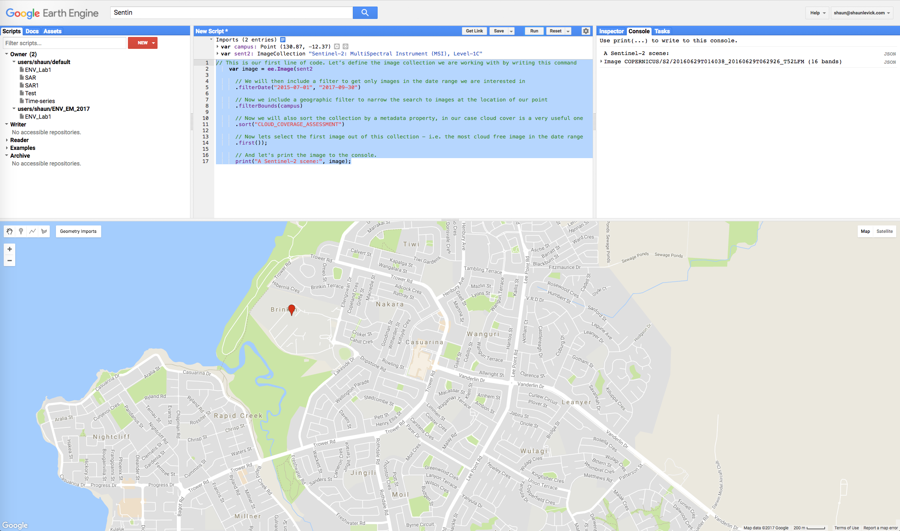
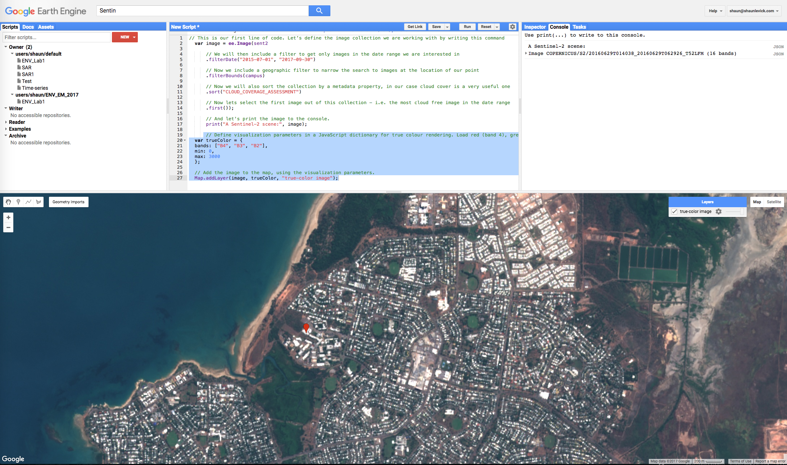
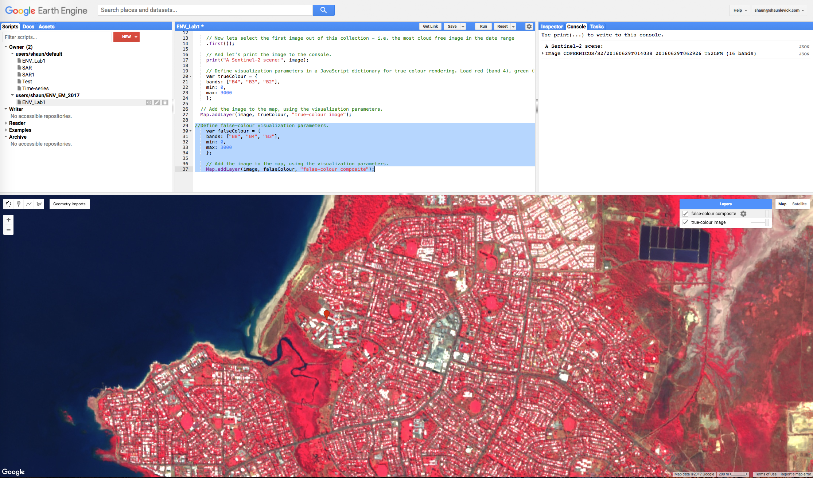
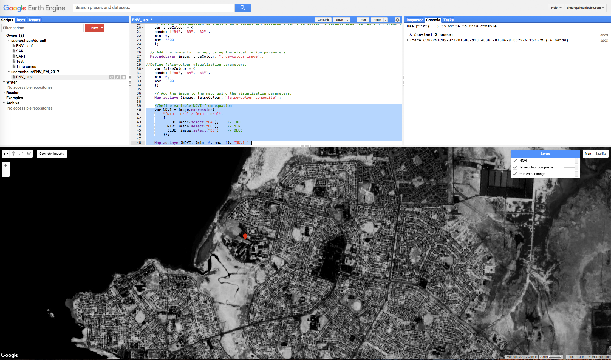

GEARS - Geospatial Engineering and Remote Sensing lab - https://www.gears-lab.com

# Introduction to Remote Sensing of the Environment
Lab 3 - From spectra to indices, and finding the right image
--------------

### Acknowledgments
- Google Earth Engine Team
- Google Earth Engine Developers group

------

### Prerequisites
-------------

Completion of this lab exercise requires use of the Google Chrome browser and a Google Earth Engine account. If you have not yet signed up - please do so now in a new tab:

[Earth Engine account registration](https://signup.earthengine.google.com/)

Once registered you can access the Earth Engine environment here:
https://code.earthengine.google.com

Google Earth Engine uses the JavaScript programming language. We will cover the very basics of this language during this course. If you would like more detail you can read through the introduction provided here:

[JavaScript background](https://developers.google.com/earth-engine/tutorial\_js\_01)

------------------------------------------------------------------------

### Objective


The objective of this lab is gain understanding of various spectral indices and develop the skills for calculating any index you require. Before getting to that, we will build upon last weeks' lab and learn how to find an image for any location of interest.

1. Just above the Coding panel is  search bar. Search for ‘Darwin’ in this GEE search bar, and click the result to pan and zoom the map to Darwin (Figure 2).





2. Use the geometry tools to make a point on Casuarina campus of Charles Darwin University (located in the suburb of Brinkin, north of Rapid Creek). Once you create the geometry point, you will see it added to your Coding panel as a variable (var) under the Imports heading.




3. Rename the resulting point ‘campus’ by clicking the import name (which is called ‘geometry’ by default).




4. Search for ‘Sentinel-2’ in the search bar. In the results section you will see ‘Sentinel-2: Multi-spectral Instrument (MSI), Level-1C’ - click on it and then click the ‘Import’ button.




5. After clicking import, Sentinel-2 will be added to our Imports in the Coding panel as a variable. It will be listed below our campus geometry point with the default name "imageCollection". Let's rename this to “sent2” by clicking on imageCollection and typing "sent2".


6. It is important to understand that we have now added access to the full Sentinel-2 image collection (i.e. every image that has been collected to date) to our script. For this exercise we don't want to load all these images - we want a single cloud free image over Charles Darwin University. As such, we can now filter the image collection with a few criteria, such as time of acquisition, spatial location and cloud cover.

---------

##Filtering image collections

7. To achieve this we need to use a bit of coding. In the JavaScript programming language two backslashes (//) indicate comment lines and are ignored in actual processing steps. We use // to write notes to ourselves in our code, so that we (and others who might want to use our code) can understand why we have done certain things.

```JavaScript
// This is our first line of code. Let’s define the image collection we are working with by writing this command
    var image = ee.Image(sent2

    // We will then include a filter to get only images in the date range we are interested in
    .filterDate("2015-07-01", "2017-09-30")

    // Next we include a geographic filter to narrow the search to images at the location of our point
    .filterBounds(campus)

    // Next we will also sort the collection by a metadata property, in our case cloud cover is a very useful one
    .sort("CLOUD_COVERAGE_ASSESSMENT")

    // Now lets select the first image out of this collection - i.e. the most cloud free image in the date range
    .first());

    // And let's print the image to the console.
    print("A Sentinel-2 scene:", image);
```

8. You need to copy the entire piece of code above and paste it in the “New script” box of the GEE code editor. Then click the "Run" button and watch Google do its magic...... This piece of code will search the full Sentinel-2 archive, find images that are located over Darwin, sort them according to percentage cloud cover, and then return the most recent cloud free image for us. Information relating to this image will be printed to the Console, where it is listed as "A Sentinel-2 scene" with some details about that scene(COPERNICUS/S2/20160629T014038\_20160629T062926\_T52LFM (16 bands)). We know from the scene name that is was collected on the 29th June 2016.


---------
## Adding images to the map view
9. Now in order to actually have a look at this image, we need to add it to our mapping environment. Before doing that however, lets define how we want to display the image. Let’s start with a true colour representation by pasting the following lines below the ones you’ve already added, and click "Run".

```javascript
// Define visualization parameters in a JavaScript dictionary for true colour rendering. Bands 4,3 and 2 needed for RGB.
    var trueColour = {
        bands: ["B4", "B3", "B2"],
        min: 0,
        max: 3000
        };

  // Add the image to the map, using the visualization parameters.
  Map.addLayer(image, trueColour, "true-colour image");
```

10. This code specifies that for a true colour image, bands 4,3 and 2 should be used in the RGB composite. After the image appears in the map, you can zoom in and explore Darwin. We see great detail in the Sentinel-2 image, which is at 10m resolution for the selected bands. The (+) and (-) symbols in the upper left corner of the map can be used for zooming in and out (also possible with the mouse scroll wheel/trackpad). A left click with the mouse brings up the "hand" for panning to move around the image. Moving your mouse over the "Layers" button in the top right-hand corner of the map panel shows you the available layers, and lets you adjust the opacity of different layers.



11. In order to find out more information at specific locations, we can use the Inspector tool which is located in the Console Panel - left hand tab. Click on the Inspector tab and then click on the image in the map view. Wherever you click on the image, the band values at that point will be displayed in the Inspector window. Click over some different patch types (sports fields, mangroves, ocean, beach, houses) to see how the spectral profile changes.


12. Now let's have a look at a false colour composite - we need to bring in the near-infrared band (band 8) for this. Paste the following lines below the ones you’ve already added, and click "Run".

```javascript
//Define false-colour visualization parameters.
    var falseColour = {
        bands: ["B8", "B4", "B3"],
        min: 0,
        max: 3000
        };

    // Add the image to the map, using the visualization parameters.
    Map.addLayer(image, falseColour, "false-color composite");
```



13. False-colour composites place the near infra-red band in the red channel, and we see a strong response to the chlorophyll content in green leaves. Vegetation that appears dark green in true colour, appearing bright red in the false-colour. Note the variations in red that can be seen in the vegetation bordering Rapid Creek. You will also see that "false-colour composite" has been added to the Layers tab in the map view.

---------

### Calculating NDVI

14. Next, let's calculate the normalised-difference vegetation index (NDVI) for this image. NDVI is an index calculated from the RED and NIR bands, according to this equation:

NDVI = (NIR - RED)/(NIR + RED)

Paste the following lines below the ones you’ve already added, and click "Run". NDVI values range from 0 to 1, and the higher the value the more "vigorous" the vegetation.


```javascript
//Define variable NDVI from equation
    var NDVI = image.expression(
        "(NIR - RED) / (NIR + RED)",
        {
          RED: image.select("B4"),    //  RED
          NIR: image.select("B8"),    // NIR
          BLUE: image.select("B2")    // BLUE
        });

    Map.addLayer(NDVI, {min: 0, max: 1}, "NDVI");
```




----
### Practical exercise

-------
### Thank you

I hope you found that useful. A recorded video of this tutorial can be found on my YouTube Channel's [Introduction to Remote Sensing of the Environment Playlist](https://www.youtube.com/playlist?list=PLf6lu3bePWHDi3-lrSqiyInMGQXM34TSV) and on my lab website [GEARS](https://www.gears-lab.com).

#### Kind regards, Shaun R Levick
------
