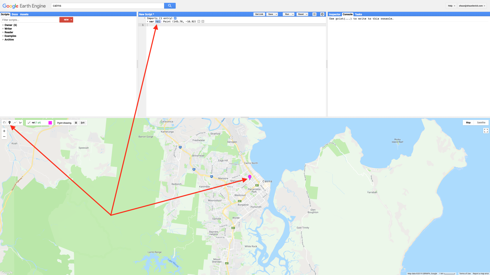
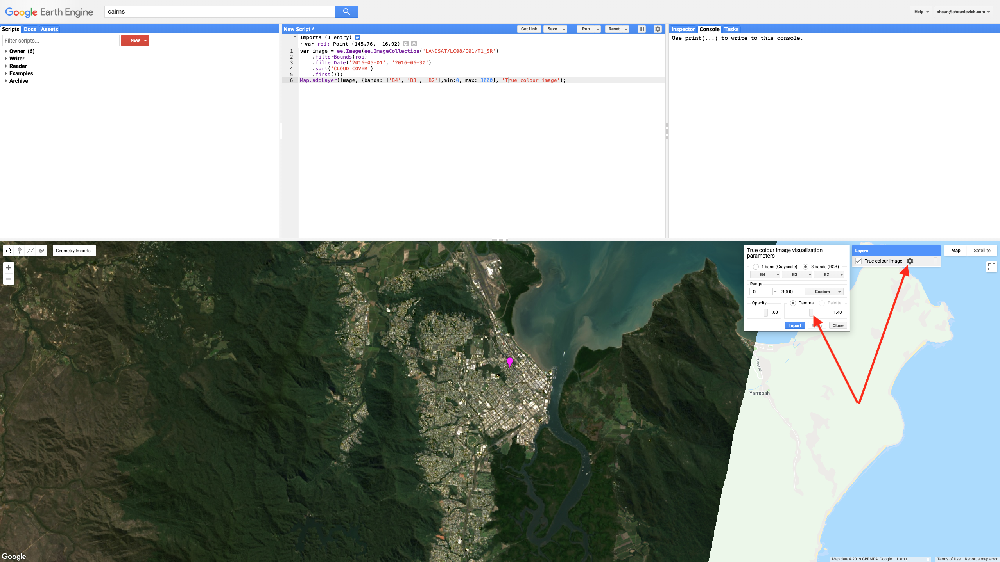
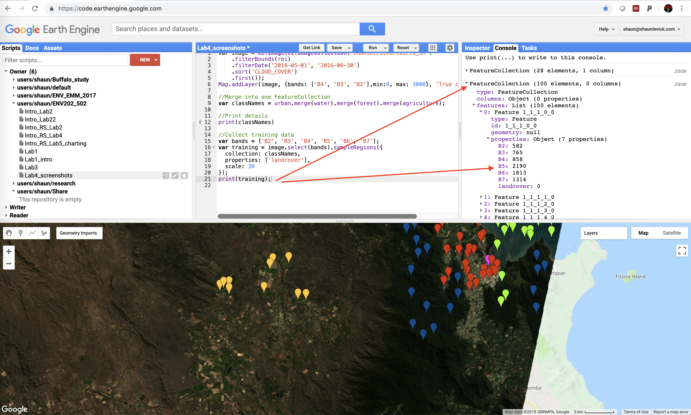

GEARS - Geospatial Engineering and Remote Sensing lab - https://www.gears-lab.com

# Introduction to Remote Sensing of the Environment
Lab 4 - Image Classification
--------------

### Acknowledgments
- Google Earth Engine Team
- Google Earth Engine Developers group
- David Saah and Nicholas Clinton

------

### Prerequisites
-------------

Completion of this lab exercise requires use of the Google Chrome browser and a Google Earth Engine account. If you have not yet signed up - please do so now in a new tab:

[Earth Engine account registration](https://signup.earthengine.google.com/)

Once registered you can access the Earth Engine environment here:
https://code.earthengine.google.com

Google Earth Engine uses the JavaScript programming language. We will cover the very basics of this language during this course. If you would like more detail you can read through the introduction provided here:

[JavaScript background](https://developers.google.com/earth-engine/tutorial\_js\_01)

------------------------------------------------------------------------

### Objective


The objective of this lab is to gain understanding of the image classification process and explore ways of turning remotely sensed imagery into landcover maps.

----------

## Loading up the image

The first step is to get a cloud free image with which to work.  Do this by importing USGS Landsat 8 Surface Reflectance Tier 1 imagery, spatially filtering to a region of interest (filterBounds), temporally filtering to your required date range (filterDate), and lastly sorting by cloud cover ('CLOUD_COVER') and extracting the least cloudy scene (first).

Building on from last week, we can use the point drawing tool (teardrop icon) from the geometry tools and draw a single point in the region of interest - let's use the town of Cairns for this example.  Then 'Exit' from the drawing tools.  Note that a new variable is created in the imports section, containing the single point, imported as a Geometry.  Change the name of this import to "roi" - short for region of interest.




Next we can run the script below to extract our desired image from the Landsat 8 collection and add it to the map view as a true-colour composite:

```JavaScript
var image = ee.Image(ee.ImageCollection('LANDSAT/LC08/C01/T1_SR')
    .filterBounds(roi)
    .filterDate('2016-05-01', '2016-06-30')
    .sort('CLOUD_COVER')
    .first());
Map.addLayer(image, {bands: ['B4', 'B3', 'B2'],min:0, max: 3000}, 'True colour image');
```


Have a look around the scene and familiarise yourself with the landscape. You'll notice the image is quite dark image - we can adjust the brightness/contrast using the settings wheels for the layer we created in the Layers tab. Slide the Gamma adjuster slightly to the right (from 1.0 to 1.4) to increase the brightness of the scene.



## Gathering training data
1. The first step in classifying our image is to collect some training data to teach the classifier.  We want to collect representative samples of reflectance spectra for each landcover class of interest.
2. Using the cloud free scene as guidance, hover on the 'Geometry Imports' box next to the geometry drawing tools and click '+ new layer.'
3. Each new layer represents one class within the training data, for example 'urban.'
4. Let the first new layer represent 'urban.'  Locate points in the new layer in urban or built up areas (buildings, roads, parking lots, etc.) and click to collect them 9adding points in the geometry layer.
5. Collect 25 representative points and rename the 'geometry' as 'urban'.


5. Next you can configure the urban geometry import (cog-wheel, top of the script in imports section) as follows.  Click the cog-wheel icon to configure it, change 'Import as'  from 'Geometry' to 'FeatureCollection'.  Use 'Add property' landcover and set its value to 0.  (Subsequent classes will be 1, 2, 3 etc.)  when finished, click 'OK'.


6. Repeat step 5 for each land cover class in that you wish to include in your classification, ensuring that training points overlap the image.   Add 'water', 'forest', and 'agriculture' next - collecting 25 points for each. Use the cog-wheel to configure the geometries, changing the type to FeatureCollection and setting the property name to landcover with values of 1, 2 and 3 for the different classes.


7. Now we have four classes defined (urban, water, forest, agriculture), but before we can use them to collect training data we need to merge them into a single collection, called a FeatureCollection. Run the following line to merge the geometries into a single FeatureCollection:

```javascript
var classNames = urban.merge(water).merge(forest).merge(agriculture);
```

8. Print the feature collection and inspect the features.

```javascript
print(classNames)
```


## Create the training data

Now we can use the FeatureCollection we created to drill through the image and extract the reflectance data for each point, from every band. We create training data by overlaying the training points on the image.  This will add new properties to the feature collection that represent image band values at each point:

```javascript
var bands = ['B2', 'B3', 'B4', 'B5', 'B6', 'B7'];
var training = image.select(bands).sampleRegions({
  collection: classNames,
  properties: ['landcover'],
  scale: 30
});
print(training);
```

After running the script the training data will be printed to the console. You will notice that the 'properties' information has now changed, and in addition to the landcover class, for each point there is now a corresponding reflectance value for each band of the image.




## Train the classifier and run the classification

Now we can train the classifier algorithm by using our examples of what different landcover class look like from a multi-spectral perspective.

```javascript
var classifier = ee.Classifier.cart().train({
  features: training,
  classProperty: 'landcover',
  inputProperties: bands
});
```

The next step is then to apply this knowledge from our training to the rest of the image - using was was learnt from our supervised collection to inform decisions about which class other pixels should belong to.

```javascript
//Run the classification
var classified = image.select(bands).classify(classifier);
```

Display the results using the mapping function below. You may need to adjust  the colours, but if the training data have been created with urban=0, water=1, forest=2, and agriculture=3 - then the result will be rendered with those classes as yellow, blue and green, respectively.


```javascript
//Display classification
Map.centerObject(classNames, 11);
Map.addLayer(classified,
{min: 0, max: 3, palette: ['red', 'blue', 'green','yellow']},
'classification');
```


## Examine your results

Congratulations - your first landcover classification! But.....
- Are you happy with the classification?
- How could it be improved?
- Try adding in some extra classes for landcover categories that show signs of confusion

We will look at how to refine this and discuss limitations and avenues for improvement next week.

-------
### Thank you

I hope you found that useful. A recorded video of this tutorial can be found on my YouTube Channel's [Introduction to Remote Sensing of the Environment Playlist](https://www.youtube.com/playlist?list=PLf6lu3bePWHDi3-lrSqiyInMGQXM34TSV) and on my lab website [GEARS](https://www.gears-lab.com).

#### Kind regards, Shaun R Levick
------
