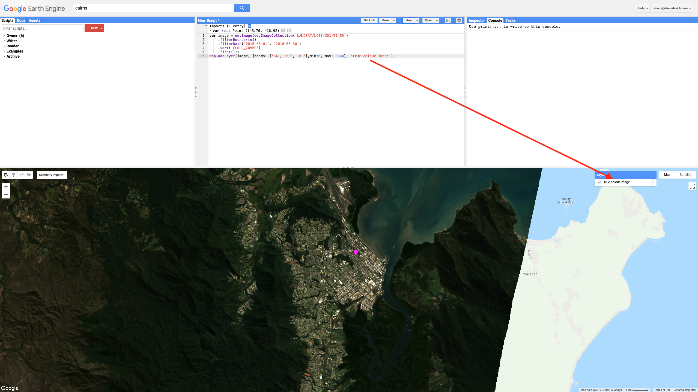

GEARS - Geospatial Engineering and Remote Sensing lab - https://www.gears-lab.com

# Introduction to Remote Sensing of the Environment
Lab 4 - Image Classification
--------------

### Acknowledgments
- Google Earth Engine Team
- Google Earth Engine Developers group

------

### Prerequisites
-------------

Completion of this lab exercise requires use of the Google Chrome browser and a Google Earth Engine account. If you have not yet signed up - please do so now in a new tab:

[Earth Engine account registration](https://signup.earthengine.google.com/)

Once registered you can access the Earth Engine environment here:
https://code.earthengine.google.com

Google Earth Engine uses the JavaScript programming language. We will cover the very basics of this language during this course. If you would like more detail you can read through the introduction provided here:

[JavaScript background](https://developers.google.com/earth-engine/tutorial\_js\_01)

------------------------------------------------------------------------

### Objective


The objective of this lab is to gain understanding of the image classification process and explore ways of turning remotely sensed imagery into landcover maps.

----------

## Loading up the image

The first step is to get a cloud free image with which to work.  Do this by importing USGS Landsat 8 Surface Reflectance Tier 1 imagery, spatially filtering to a region of interest (filterBounds), temporally filtering to your required date range (filterDate), and lastly sorting by cloud cover ("CLOUD_COVER) and extracting the least cloudy scene (first).

Building on from last week, we can use the point drawing tool (teardrop icon) from the geometry tools and draw a single point in the region of interest - let's use the town of Cairns for this example.  Then 'Exit' from the drawing tools.  Note that a new variable is created in the imports section, containing the single point, imported as a Geometry.  Chnage the name of this import to "roi" - short for region of interest.


Next we can run the script below to extract our desired image from the Landsat 8 collection and add it to the map view as a true-colour composite:

```JavaScript
var image = ee.Image(ee.ImageCollection('LANDSAT/LC08/C01/T1_SR')
    .filterBounds(roi)
    .filterDate('2016-05-01', '2016-06-30')
    .sort('CLOUD_COVER')
    .first());
Map.addLayer(image, {bands: ['B4', 'B3', 'B2'],min:0, max: 3000}, 'True colour image');
```



Have a look around the scene and familiarise yourself with the landscape. You'll notice the image is quite dark image - we can adjust the brightness/contrast using the settings wheels for the layer we created in the Layers tab. Slide the Gamma adjuster slightly to the right (from 1.0 to 1.4) to increase the brightness of the scene.


## Gathering training data
1. The next step is to collect training data for classification.  Using the cloud free scene as guidance, hover on the 'Geometry Imports' box next to the geometry drawing tools and click '+ new layer.'
2. Each new layer represents one class within the training data, for example 'urban.'
3. Let the first new layer represent 'urban.'  Locate points in the new layer in urban or built up areas (buildings, roads, parking lots, etc.) and click to collect them.
4. When finished collecting points, click 'Exit' and configure the import (top of the script) as follows.  Name the layer 'urban' and click the  icon to configure it.  'Import as' FeatureCollection.  'Add property' landcover and set its value to 0.  (Subsequent classes will be 1, 2, etc.)  when finished, click 'OK' as shown:
5. Repeat step 4 for each land cover class in the classification, ensuring that training points overlap the image.   An easy one is to get vegetation and water points next, for a total of three classes: {urban, vegetation, water}.
6. Add the following line to merge the imports into a single FeatureCollection:

```javascript
var newfc = urban.merge(water).merge(vegetation);
```

Optional: print the feature collection and inspect the features.


## Create the training data

Create training data by overlaying the training points on the image.  This will add new properties to the feature collection that represent image band values at each point:
```javascript
var bands = ['B2', 'B3', 'B4', 'B5', 'B6', 'B7'];
var training = image.select(bands).sampleRegions({
  collection: newfc,
  properties: ['landcover'],
  scale: 30
});
```

Optional: print the training data and inspect the features to ensure there is a class value and properties corresponding to image bands.

## Train the classifier and run the classification

First we need to train the classifier by providing examples of what different landcover class look like from a multi-spectral perspective.

```javascript
var classifier = ee.Classifier.cart().train({
  features: training,
  classProperty: 'landcover',
  inputProperties: bands
});
```

Then we can apply this knowledge to the rest of the image - using was was learnt from our training to inform decisions about which class other pixels should belong to.

```javascript
//Run the classification
var classified = image.select(bands).classify(classifier);
```

Display the results.  You may need to adjust  the colors, but if the training data have been created with urban=0, water=1 and vegetation=2, then the result will be rendered with those classes as yellow, blue and green, respectively.

```javascript
//Display classification
Map.centerObject(newfc, 11);
Map.addLayer(image,
{bands: ['B4', 'B3', 'B2'], min:0, max: 3000},
'Landsat image');
Map.addLayer(classified,
{min: 0, max: 2, palette: ['yellow', 'blue', 'green']},
'classification');
Map.addLayer(newfc);
```

## Examine your results

- Are you happy with the classification?
- How could it be improved?
- Try adding in some extra classes for landcover categories that show signs of confusion

-------
### Thank you

I hope you found that useful. A recorded video of this tutorial can be found on my YouTube Channel's [Introduction to Remote Sensing of the Environment Playlist](https://www.youtube.com/playlist?list=PLf6lu3bePWHDi3-lrSqiyInMGQXM34TSV) and on my lab website [GEARS](https://www.gears-lab.com).

#### Kind regards, Shaun R Levick
------
