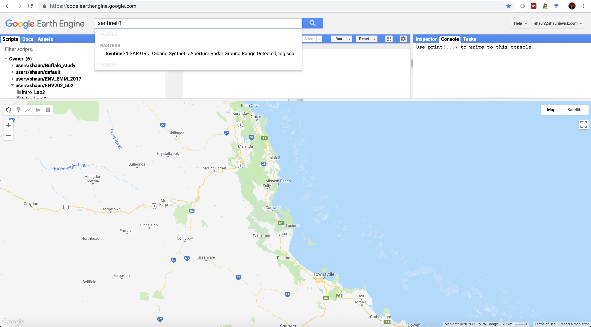
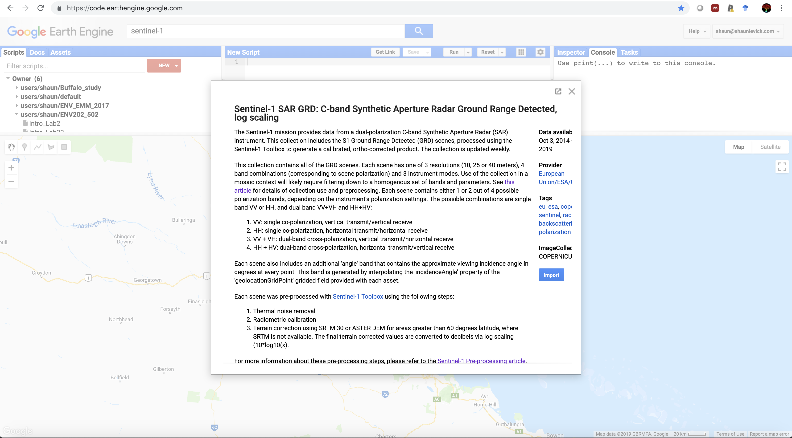
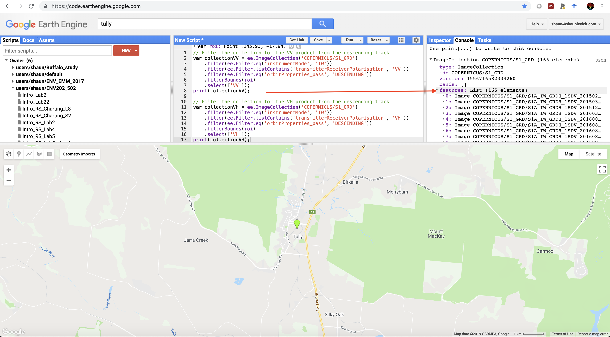
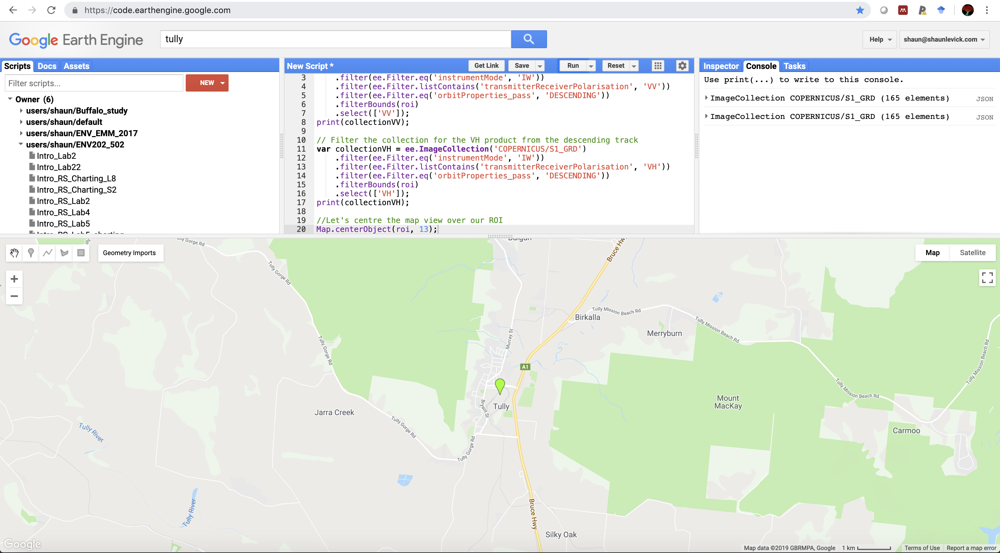

GEARS - Geospatial Engineering and Remote Sensing lab - https://www.gears-lab.com

# Introduction to Remote Sensing of the Environment
Lab 8 - Working with SAR data in Google Earth Engine
--------------

### Acknowledgments
- Google Earth Engine Team
- Google Earth Engine Developers group

------

### Prerequisites
-------------

Completion of this lab exercise requires use of the Google Chrome browser and a Google Earth Engine account. If you have not yet signed up - please do so now in a new tab:

[Earth Engine account registration](https://signup.earthengine.google.com/)

Once registered you can access the Earth Engine environment here:
https://code.earthengine.google.com

This lab follows on from others in this series:

[Lab 1](https://github.com/geospatialeco/GEARS/blob/master/Intro_RS_Lab1.md) -
[Lab 2](https://github.com/geospatialeco/GEARS/blob/master/Intro_RS_Lab2.md) -
[Lab 3](https://github.com/geospatialeco/GEARS/blob/master/Intro_RS_Lab3.md) -
[Lab 4](https://github.com/geospatialeco/GEARS/blob/master/Intro_RS_Lab4.md) -
[Lab 5](https://github.com/geospatialeco/GEARS/blob/master/Intro_RS_Lab5.md) -
[Lab 6](https://github.com/geospatialeco/GEARS/blob/master/Intro_RS_Lab6.md) -
[Lab 7](https://github.com/geospatialeco/GEARS/blob/master/Intro_RS_Lab7.md)


------------------------------------------------------------------------

### Objective


The objective of this lab is deepen your understanding of Synthetic Aperture Radar (SAR) data, and learn how to visualise different composites in Google Earth Engine.

----------

## Visualising Sentinel-1 data

1. Open up Earth Engine and type "Sentinel-1" into the search bar. Click on the Sentinel-1 result and read through the background information on the satellite and image properties.





2. Sentinel-1 has different polarisation options - remember that "VV" means vertically polarised signal transmitted out and vertically polarised signal received, whereas VH refers to vertically polarised signal transmitted out, and horizontally polarised signal is received.
3. First up we need to filter the Sentinel-1 image collection (COPERNICUS/S1_GRD), using the script below. Be sure to use the geometry tool to create a point geometry over your region of interest (we will use the Tully region of north Queensland, Australia, as an example) and rename it "roi".


```JavaScript
// Filter the collection for the VV product from the descending track
var collectionVV = ee.ImageCollection('COPERNICUS/S1_GRD')
    .filter(ee.Filter.eq('instrumentMode', 'IW'))
    .filter(ee.Filter.listContains('transmitterReceiverPolarisation', 'VV'))
    .filter(ee.Filter.eq('orbitProperties_pass', 'DESCENDING'))
    .filterBounds(roi)
    .select(['VV']);
print(collectionVV);

// Filter the collection for the VH product from the descending track
var collectionVH = ee.ImageCollection('COPERNICUS/S1_GRD')
    .filter(ee.Filter.eq('instrumentMode', 'IW'))
    .filter(ee.Filter.listContains('transmitterReceiverPolarisation', 'VH'))
    .filter(ee.Filter.eq('orbitProperties_pass', 'DESCENDING'))
    .filterBounds(roi)
    .select(['VH']);
print(collectionVH);
```

4. Navigate to the console and have a look at the information you printed. Using the drop down arrows you can assess how many images are present in teh collection for your region of interest.




5. Centre the map view over your region of interest

```JavaScript
//Let's centre the map view over our ROI
Map.centerObject(roi, 13);
```




6. Use the median reducer to obtain the median pixel value across the all years for each pixel.

```JavaScript
var VV = collectionVV.median();
```
7. Plot the median pixel values to the map view. Adjust the min and max visualisation parameters according to your chosen scene - us the inspectors to help you establish the value range.

```JavaScript
// Adding the VV layer to the map
Map.addLayer(VV, {min: -14, max: -7}, 'VV');
```


8. Explore the image and examine which landscape features have high backscatter intensity (white), and which low intensity (black).
9. Now derive the the VH median layer, map it, and explore how it differs to VV.

```JavaScript
//Calculate the VH layer
var VH = collectionVH.median();
Map.addLayer(VH, {min: -14, max: -7}, 'VH');
```

10. Next we will experiment with making an RGB composite from the SAR data. To do this we need to create three layers that we can place into the Red, Green, and Blue channels.

```JavaScript
// Create a 3 band stack by selecting from different periods (months)
var VV1 = ee.Image(collectionVV.filterDate('2018-01-01', '2018-04-30').median());
var VV2 = ee.Image(collectionVV.filterDate('2018-05-01', '2018-08-31').median());
var VV3 = ee.Image(collectionVV.filterDate('2018-09-01', '2018-12-31').median());

//Add to map
Map.addLayer(VV1.addBands(VV2).addBands(VV3), {min: -12, max: -7}, 'Season composite');
```
11. Now try the same for VH, and try mixing VV and VH in a RGB composite
12. Think about how this information differs to the optical data you have used so far, and how it could compliment it.
-------

### Thank you

I hope you found that useful. A recorded video of this tutorial can be found on my YouTube Channel's [Introduction to Remote Sensing of the Environment Playlist](https://www.youtube.com/playlist?list=PLf6lu3bePWHDi3-lrSqiyInMGQXM34TSV) and on my lab website [GEARS](https://www.gears-lab.com).

#### Kind regards, Shaun R Levick
------
